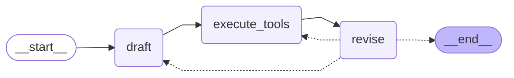

# Reflexion Agent with LangGraph 🦜🕸️

LangGraph와 LangChain을 활용해 구현한 **Reflexion Agent** 예제 프로젝트입니다.  
이 에이전트는 **자기 성찰(Self-Reflection)** 과 **반복적 개선(Iterative Refinement)** 을 통해 응답의 품질을 점진적으로 향상시키도록 설계되었습니다.

LangGraph의 **그래프 기반 제어 흐름**을 활용하여  
초기 응답 생성 → 도구 실행 → 비판 및 수정 → 재작성이라는 사이클을 구조적으로 구현합니다.



## 주요 기능

- **자기 성찰(Self-Reflection)**: 응답 개선을 위한 정교한 성찰 메커니즘 구현
- **반복적 개선(Iterative Refinement)**: 그래프 기반 접근법을 통한 응답의 점진적 향상
- **통합 검색**: Tavily 검색을 활용한 향상된 응답 정확도
- **구조화된 출력**: Pydantic 모델을 사용한 안정적인 데이터 처리

## 아키텍처

이 에이전트는 다음 구성 요소로 이루어진 그래프 기반 아키텍처를 사용합니다:

- **진입점(Entry Point)**: 초기 응답 생성을 위한 `draft` 노드
- **처리 노드(Processing Nodes)**: 개선을 위한 `execute_tools` 및 `revise` 노드
- **최대 반복 횟수**: N회 (설정 가능)
- **체인 구성 요소**: GPT를 사용하는 First Responder와 Revisor
- **도구 통합**: 웹 조사를 위한 Tavily Search

## 환경 변수 설정

이 프로젝트를 실행하려면 `.env` 파일에 다음 환경 변수를 추가해야 합니다:
```bash
OPENAI_API_KEY=your_openai_api_key_here
TAVILY_API_KEY=your_tavily_api_key_here
LANGCHAIN_API_KEY=your_langchain_api_key_here  # 선택사항, 트레이싱용
LANGCHAIN_TRACING_V2=true                      # 선택사항
LANGCHAIN_PROJECT=reflexion agent               # 선택사항
```

> **중요**: `LANGCHAIN_TRACING_V2=true`로 트레이싱을 활성화하는 경우, `LANGCHAIN_API_KEY`에 유효한 LangSmith API 키가 설정되어 있어야 합니다. 유효한 API 키 없이 실행하면 오류가 발생합니다. 트레이싱이 필요하지 않다면 해당 환경 변수들을 제거하거나 주석 처리하세요.

## 로컬 실행 방법

프로젝트 클론:
```bash
git clone 
cd reflexion-agent
```

의존성 설치:
```bash
poetry install
```

에이전트 실행:
```bash
poetry run python main.py
```

## 개발 환경 설정

1. API 키 발급받기:
   - [OpenAI Platform](https://platform.openai.com/) - GPT 접근용
   - [Tavily](https://tavily.com/) - 검색 기능용
   - [LangSmith](https://smith.langchain.com/) (선택사항) - 프로젝트 로그 추적적용

2. 예제 환경 파일 복사:
```bash
   cp .env.example .env
```

3. `.env` 파일에 API 키 입력

## Notes

본 프로젝트는 학습 및 실험 목적의 예제입니다.

반복 횟수, 프롬프트 구조, 종료 조건은 자유롭게 확장 가능합니다.
```

## 🔗 링크
[](https://www.udemy.com/course/langgraph/?referralCode=FEA50E8CBA24ECD48212)
[](https://www.linkedin.com/in/eden-marco/)
[](https://twitter.com/EdenEmarco177)
